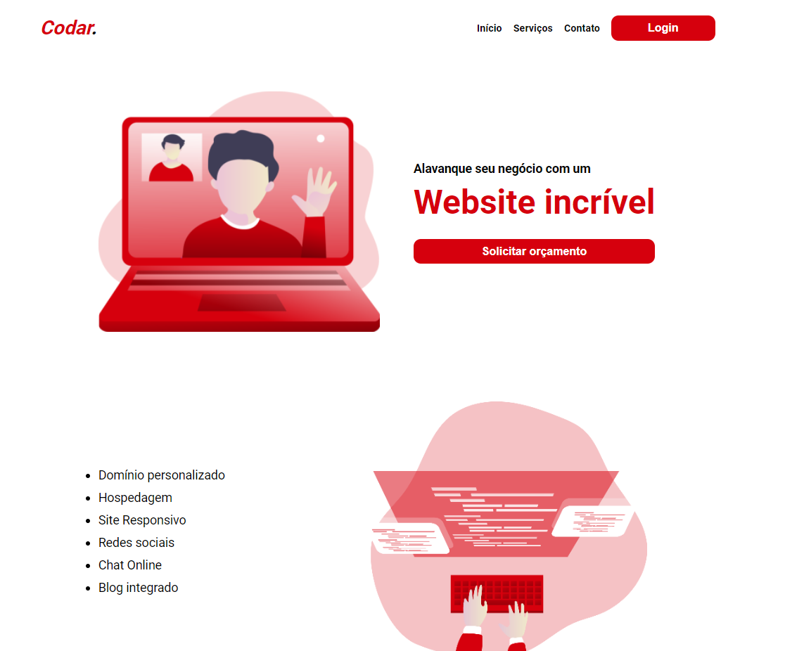

  <a href="#-tecnologias">Tecnologias</a>&nbsp;&nbsp;&nbsp;|&nbsp;&nbsp;&nbsp;
  <a href="#-projeto">Projeto</a>&nbsp;&nbsp;&nbsp;|&nbsp;&nbsp;&nbsp;
  <a href="#-layout">Layout</a>&nbsp;&nbsp;&nbsp;|&nbsp;&nbsp;&nbsp;
  <a href="#memo-licença">Licença</a>

 

  

 

  

## 🚀 Tecnologias

Esse projeto foi desenvolvido com as seguintes tecnologias:

- HTML
- CSS

## 💻 Projeto
Codar. é uma página de uma empresa fictícia que desenvolve sites para diversas empresas, Domínio personalizado, Hospedagem, Site responsivo, Redes Sociais, Chat Online e Blog integrado. Contém as seções: Menu, Colunas Centrais e Footer

## 🔖 Layout

Você pode visualizar o layout do projeto através [desse link](https://www.devchallenge.com.br/challenges/5ed47992adee277fae224a0b/details).

## 📝 Licença

Esse projeto está sob a licença MIT. Veja o arquivo [LICENSE](LICENSE) para mais detalhes.

---

Feito com ♥ by viniciusmaclters :wave:
